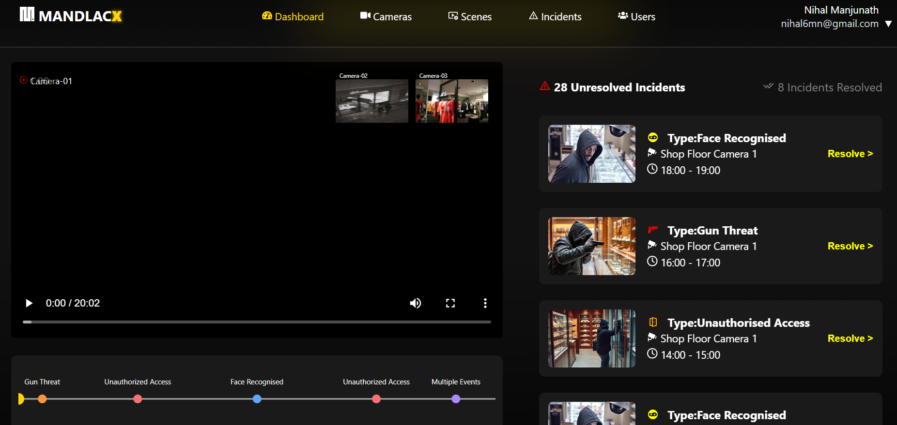

# SecureSight Dashboard

A modern incident review dashboard with interactive video timeline, camera insights, and incident management.

---

## 🔗 Live Demo  
[https://secure-sight-dashboard-j8jp.vercel.app/](https://secure-sight-dashboard-j8jp.vercel.app/)

---

## 🛠️ Deployment Instructions

### Local Development

1. **Clone the repo:**
   ```bash
   git clone https://github.com/your-username/secure-sight-dashboard.git
   cd secure-sight-dashboard
   ```

2. **Install dependencies:**
   ```bash
   npm install
   ```

3. **Set up environment variables:**
   Create a `.env` file in the root directory with:
   ```env
   DATABASE_URL=your_postgresql_database_url
   ```

4. **Generate Prisma client:**
   ```bash
   npx prisma generate
   ```

5. **Run the development server:**
   ```bash
   npm run dev
   ```

> App should be running at `http://localhost:3000`.


---

## ⚙️ Tech Decisions

- **Framework:** [Next.js 15](https://nextjs.org/) with App Router for modern routing and API routes.
- **Database:** Prisma + Neon DB, Prisma for type-safe DB access; Neon for scalable serverless Postgres.
- **Hosting:** [Vercel](https://vercel.com/) for frontend & serverless backend.
- **Styling:** CSS for fast and responsive UI development.
- **Video Handling:** Native HTML5 `<video>` element paired with an interactive SVG/Canvas-based incident timeline.
- **Type Safety:** TypeScript for compile-time safety.
- **API Design:** RESTful endpoints (e.g. `PATCH /api/incidents/:id/resolve`).

---
## 📸 Screenshots  

### Dashboard View  
  